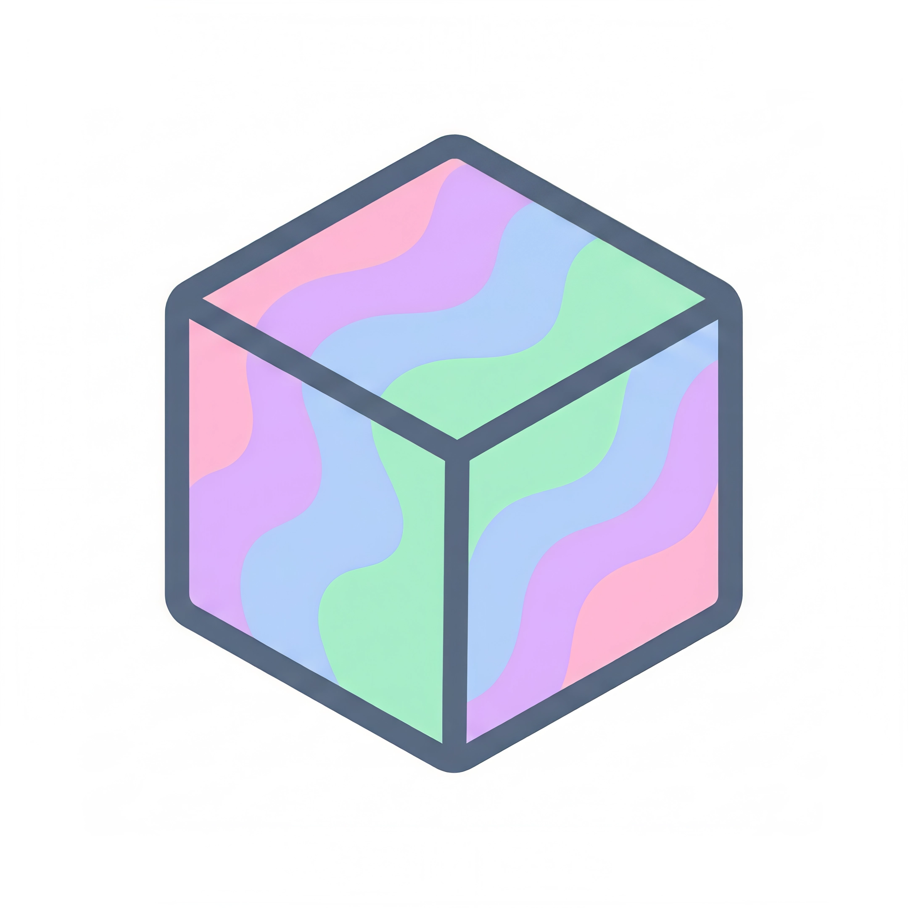

<p align="center">
  
</p>

# colorful

a pastel-colored CLI for image generation & AI chat via OpenRouter, all in one file.

## install

```bash
git clone https://github.com/fernandorodriguezrada/colorful.git
cd colorful
python install.py
```

The installer creates a venv, installs dependencies, sets up `.env`, and adds the `colorful` command to your shell.

> **Windows**: works! Only the kitty image preview is skipped (falls back to saving the file).

## usage

### chat (default)

```bash
colorful                               # start interactive chat
colorful -p "what is the meaning of life?"  # single prompt → chat
```

Inside a chat session:
- `/chats` — list saved conversations
- `/load N` — resume a chat by number
- `/new` — start fresh
- `/model <slug>` — switch model
- `/exit` — leave

### image generation

```bash
colorful -i photo.jpg -p "make it a painting"
colorful -i photo.jpg -p "turn it into anime" -o result.png
colorful -i photo.jpg -p "add a rainbow" --no-display
```

### models

```bash
colorful --list-models           # all models (image + text)
colorful --list-text-models      # text models only
colorful --set-default-model <slug>
colorful --set-default-text-model <slug>
```

### customize

| env var | default |
|---|---|
| `OPENROUTER_API_KEY` | *(required)* |
| `COLORFUL_MODEL` | first image model |
| `COLORFUL_TEXT_MODEL` | first text model |
| `COLORFUL_OUTPUT_DIR` | same folder as input image |

## chat history

Saved as JSON in `~/.local/share/colorful/chats/`. Resume any past conversation with `/chats`.

## requirements

- Python 3.9+
- [OpenRouter API key](https://openrouter.ai/keys)
- *(optional)* [kitty terminal](https://sw.kovidgoyal.net/kitty/) for inline image preview
